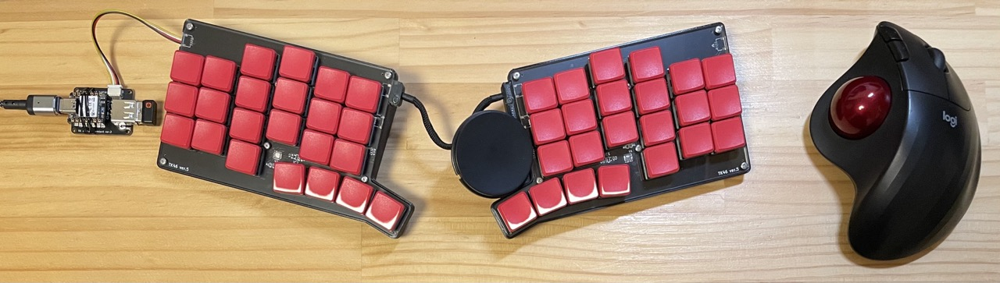

# modulo keyboard

[schematic](keyboard_sch.pdf)

* Pendant (micro controller nRF52840: i2c + USB mouse host) : [schematic](pendant_sch.pdf)

 
* Keyboard controller (AtTiny817: io expander & i2c to ws2812 bridge) [link](https://github.com/tadakado/modulo_io_expander)
* USB mouse host controller (CH559) [link](https://github.com/tadakado/CH559sdccUSBmouseHost)
* Firmware (QMK firmware) [link](https://github.com/tadakado/qmk_firmware)
